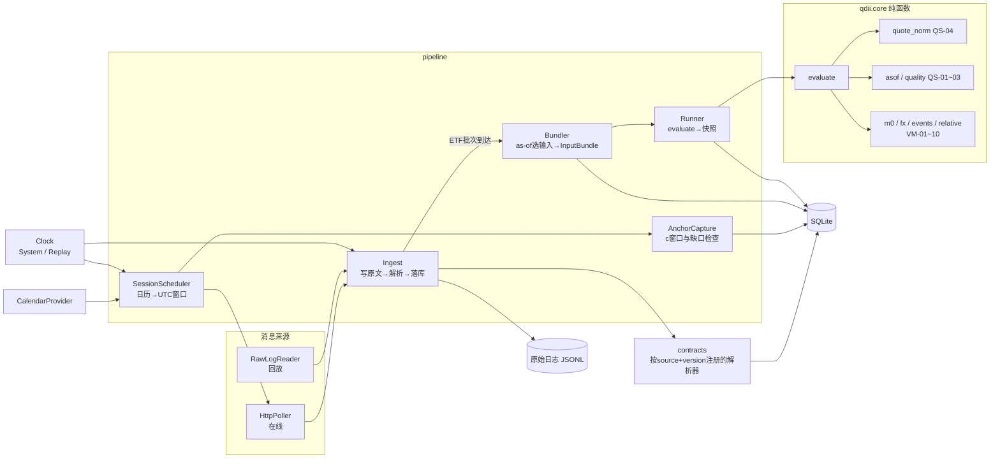
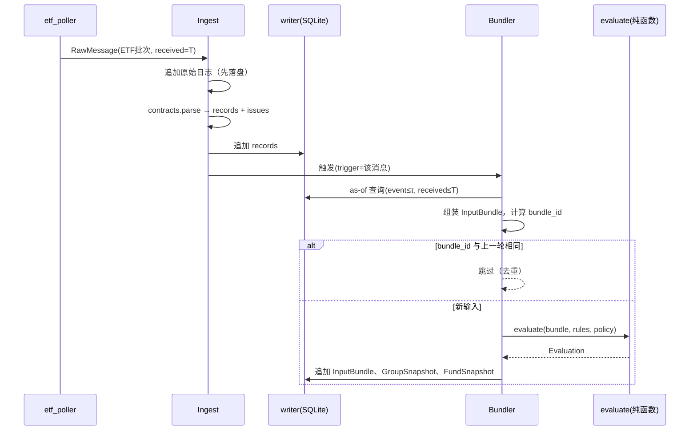
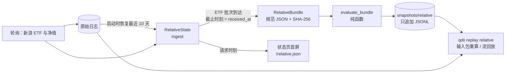
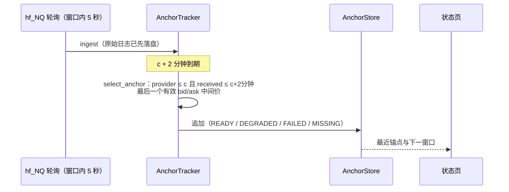

# ADD-0：Phase 0 工具与不变核心架构设计

文档ID：ADD-0；版本：0.1 草案；日期：2026-09-15。
输入：[SRD 1.3](spec/QDII_Nasdaq100_Realtime_Premium_SRD.md)、[DS 1.0](spec/QDII_Data_Contract_Spec.md)、[VM 1.0](spec/QDII_Valuation_Model_Spec.md)、[QS 1.0](spec/QDII_Quality_State_Spec.md)，以及 [SRD 1.3 勘误](SRD_v1.3_errata.md) E1—E7。
已定前提：实现语言 Python；Phase 0 采集主机为法国家中的 MacBook；**主机只保证巴黎时间 07:30 至 A 股收盘可用**（§15）；状态页仅本机访问。

## 0 范围

ADD-0 只设计两类东西：

1. **Phase 0 工具**：SRD §3 的 PH0-01—PH0-08（勘误 E4 将 "P0-xx" 改称 "PH0-xx"）所需的录制、采集、锚点捕获、回放、历史验证与能力探测。
2. **不随 GO 路径变化的核心**：来源契约、原始日志、版本化记录、InputBundle、估值纯函数、质量计算、回放机制、日历与时钟抽象。

Phase 0 工具就是 MVP 数据管道的第一版，不是一次性脚本。GO-R / GO-E / GO-V 任一结论下，第 2 类组件都保留；变化的部分留给 ADD-1（见 §12）。

不在本文范围：首屏界面、价格机会通知、自动备源切换、M1/M2 拟合、PCF 代理、远程访问方式。

## 1 架构驱动因素

| # | 驱动因素 | 来源 | 架构后果 |
|---|---|---|---|
| D1 | 同一输入、规则与计算时刻得到相同数值和理由 | NFR02、FR11、DS-12 | 估值为纯函数；InputBundle 自包含且可哈希；回放与在线同一路径 |
| D2 | 按"当时可知"选择输入，修订不倒灌 | DS-11、QS-05、AT27/50/70 | 所有记录只追加并带 `received_at`；as-of 查询是唯一取数方式 |
| D3 | 免费源格式不受控、可能随时变化 | DS-03—06、DS-08 | 先存原始字节再解析；解析器按 `contract_version` 注册，可对历史原文重解析 |
| D4 | 录制日是瓶颈资源，不能等解析器完善 | PH0 需 10 个真实 A 股会话 | 原始录制器最先上线；解析、估值可事后在原文上补跑 |
| D5 | 每个 NQ 源在每个美股收盘 c 各自采锚点，漏采可检测 | DS-09、DS-10 | 由日历驱动的锚点捕获任务，c+2 分钟缺口检查，捕获状态落库。**受 §15 主机窗口约束，实时捕获暂不可行，只保留补采路径** |
| D6 | R 模式不依赖 NQ / 即期 FX | SRD §2、VM-10、DS-07 | NQ/FX 采集是可开关模块；相对结果为组级输出（勘误 E2） |
| D7 | 个人维护、家用主机 | SRD §1、NFR10 | 单进程、SQLite、无消息队列；进程崩溃与断电可恢复并留下缺口记录 |
| D8 | 主机在法国，本地时区为 Europe/Paris，既非上海也非纽约；A 股交易时段是巴黎凌晨，无人值守 | DS-10、已定前提 | 代码内禁用本地时区；测试随机化 `TZ`；故障必须自恢复或留下可见缺口 |
| D9 | 主机位于中国大陆以外，国内端点的可达性与行为未知 | 已定前提、DS-08 | 端点可达性探测列为第一天任务，结果可能推翻主机位置决定（§8.3） |

## 2 决策记录（ADR 摘要）

| ADR | 决策 | 主要理由 | 被放弃的方案 |
|---|---|---|---|
| 001 | Python 3.12，`uv` 锁定依赖；升级解释器或关键库须重跑全部回放夹具 | 日历库、历史研究生态；锁定避免浮点与库行为漂移 | 3.13/3.14：部分科学计算依赖兼容性需额外验证 |
| 002 | 单进程 `asyncio` + `httpx`；所有数据库写入由单一写入协程串行完成 | 数据量小；SQLite 单写者最稳 | 多进程 / 消息队列：个人维护成本高 |
| 003 | 原始日志：按来源、UTC 日期、UTC 小时分段的 JSONL；当前小时明文追加，轮转后 gzip | 崩溃只丢未刷盘的尾行；gzip 流截断会损坏整段 | 直接写 `.jsonl.gz`；写入数据库 BLOB |
| 004 | 规范化记录、InputBundle、快照存 SQLite（WAL）；研究用 DuckDB/pandas 只读访问 | 零运维；容量粗估见 §5.4 | 时序数据库、Postgres |
| 005 | `qdii.core` 为纯函数包：不导入 I/O、网络、时钟、数据库模块；用 `import-linter` 在 CI 中强制 | D1；让 VM/QS 规则可直接单元测试 | 靠约定自律 |
| 006 | 时间统一为 UTC 纳秒整数加 `TimeResolution`；墙钟与单调钟都经 `Clock` 协议注入 | D2、D8；回放用虚拟时钟 | `datetime` 带本地时区 |
| 007 | 解析与格点/零值校验用 `Decimal`（从原始字符串构造）；模型计算用 `float` | `"0.000"`、tick 格点判断需精确；模型容差 1e-8 足够 | 全程 `Decimal`：模型函数与数值库不便 |
| 008 | **在线采集与锚点捕获不使用 AKShare**；自写最小 HTTP 模板与解析器。AKShare 仅用于研究和探测中的历史数据 | 在线路径必须保留原始字节、原始时间字段（DS-06 已指出适配器会丢时间） | 在线直接调用 AKShare |
| 009 | 回放与在线共用 Ingest→Bundler→evaluate，差别只在消息源（HTTP / 原始日志）与时钟（系统 / 虚拟） | 回放另写一套就无法证明在线逻辑正确 | 独立回放脚本 |
| 010 | `knowledge_cutoff` 取**触发本轮计算的消息的 `received_utc_ns`**；新鲜度年龄以 cutoff 为参照；`computed_at` 仅作元数据，不进结果哈希 | 回放可逐位复现；避免计算耗时让 60 秒边界来回翻转（勘误 E7） | 以计算完成时的墙钟为 cutoff |
| 011 | 确定性比对：枚举、理由码、ID 精确相等；浮点绝对差 ≤1e-10 | 开发机与家用主机 CPU 架构可能不同，`exp/log` 末位可能不同 | 对浮点序列化后直接做哈希全等 |
| 012 | 输出分 `GroupSnapshot`（S、排名、成对 R/δ）与 `FundSnapshot`（绝对估值） | 相对比较本质是组级与成对数据（勘误 E2） | 在单基金 JSON 里挂 `benchmark_code` |
| 013 | 日历通过 `CalendarProvider` 接口接入：锁定版本的库适配器，加维护者覆盖文件；最终选库由 PH0-08 实测决定 | DS-10；库对 XSHE/NQ 支持尚未验证 | Phase 0 前就绑定某个库 |
| 014 | 状态页只读；始终绑定 `127.0.0.1`，另绑定局域网 IPv4 私网地址并校验来源子网；不监听 IPv6 全局地址；无公网访问、无端口转发；局域网监听失败不影响回环 | NFR07；已定前提；实测主机防火墙为"阻止所有传入连接"，回环不受影响 | 监听 `0.0.0.0` / `::`；Phase 0 引入认证系统 |
| 015 | **（修订）** macOS 以用户级 LaunchAgent 守护，不用 LaunchDaemon | FileVault 已决定保持开启：开机解锁即登录该用户，LaunchAgent 与 LaunchDaemon 的可用时间相同，而 LaunchAgent 无需 sudo、只写用户目录 | LaunchDaemon（原决策，前提已变）；手动在终端运行 |
| 016 | 进程自持 `caffeinate -i -m -s -w <pid>` 电源断言防止空闲睡眠，不修改系统 `pmset` 设置 | 不改系统设置、进程退出即释放；合盖仍会睡眠，由状态页电源与缺口记录暴露 | 要求维护者修改 pmset |
| 017 | HTTP 跟随重定向（最多 5 次），`final_url`、跳转链、响应头白名单写入 RawMessage；`trust_env=False` 不读环境代理 | 实测东方财富 302 到 `push2delay`，不记录跳转就会把延迟通道误当实时源；固定访问路径符合 DS-08 | 不跟随重定向；跟随但不记录 |

## 3 逻辑视图

### 3.1 组件



### 3.2 包结构与依赖规则

```text
src/qdii/
  core/                 # 纯函数：只依赖标准库与 core 内部
    types.py            # UtcNs、TimeResolution、Instant、枚举（QS-01）、理由码登记（QS-07）
    quote_norm.py       # 原始价量字符串 → QuoteSide（QS-04）
    asof.py             # as-of 选择、τ 求解、跨度与年龄（QS-02）
    quality.py          # 质量对象聚合、anchor_health（QS-01~03）
    model_m0.py         # VM-01~03
    fx.py               # VM-08（经济口径、规则口径、CNH 代理）
    events.py           # VM-09（派息、拆分、幂等应用）
    relative.py         # VM-10（B、S、R、δ、准入与退出）
    evaluate.py         # evaluate(bundle, rules, policy) -> Evaluation
  contracts/            # 纯解析：RawMessage → ParseResult；只依赖 core.types
    registry.py
    sina_a_share_v1.py  tencent_a_share_v1.py  eastmoney_stock_get_v1.py
    eastmoney_lsjz_v1.py  sina_hf_v1.py  sina_fx_v1.py  cfets_spot_v1.py
    safe_midrate_v1.py  sina_us_index_hist_v1.py
  io/
    clock.py            # SystemClock、ReplayClock、NtpProbe
    http.py             # 请求模板、退避、403/429 停止（DS-07/08）
    rawlog.py           # RawLogWriter / RawLogReader
    store.py            # SQLite 仓储；只暴露追加与 as-of 查询
    calendars.py        # CalendarProvider 适配器 + overrides 加载校验
  pipeline/
    ingest.py  scheduler.py  capture.py  bundler.py  runner.py  writer.py
  apps/
    collect.py          # 守护进程
    replay.py           # 回放与确定性比对 CLI
    probe.py            # 来源 / 环境能力探测 → 能力矩阵
    research_nav.py     # PH0-07 历史经济验证
    status.py           # 只读状态页
config/
  funds.toml            # FundProfile 初始配置（五只）
  sources.toml          # 端点、窗口、刷新间隔、启用开关
  policies/QPOL-1.0.toml
  calendar_overrides/*.yaml
data/fund_rules/<code>.yaml   # PH0-06 人工核验结果与证据
tests/
  unit/ property/ contract/ replay/
  fixtures/synthetic/   # 合成故障流（run_id 以 SYN- 开头）
  fixtures/recorded/    # 实采片段（大文件不入库，只存清单与哈希）
```

依赖方向（由 import-linter 强制）：`apps → pipeline → io → contracts → core`；`core` 不得导入其他任何层；`contracts` 只可导入 `core`（解析器需要调用 `core.quote_norm` 执行 QS-04 归一化）。`core` 与 `contracts` 不得导入网络、进程、数据库、`time` 等标准库模块，由 `tests/test_architecture.py` 做 AST 检查。

### 3.3 关键接口

```python
# core/types.py
UtcNs = NewType("UtcNs", int)

class TimeResolution(StrEnum):
    NS = "NS"; MS = "MS"; S = "S"; MINUTE = "MINUTE"; DATE = "DATE"; UNKNOWN = "UNKNOWN"

@dataclass(frozen=True, slots=True)
class Instant:
    utc_ns: UtcNs | None            # None 表示语义未知，不猜日期
    resolution: TimeResolution
```

```python
# io/rawlog.py 与 contracts
@dataclass(frozen=True, slots=True)
class RawMessage:
    msg_id: str                     # f"{source_id}:{received_utc_ns}:{seq}"，确定性
    run_id: str                     # LIVE-yyyymmdd-host 或 SYN-xxx
    source_id: str
    endpoint_id: str
    request: RequestTemplate        # 方法、URL模板、参数、无凭据请求头
    status: int | None              # None = 网络层失败
    error: str | None               # timeout / dns / reset ...
    body: bytes                     # 原始字节，不预先解码
    body_sha256: str
    received_utc_ns: UtcNs
    monotonic_ns: int
    clock: ClockStatus              # synced、offset_ms、checked_at

class Parser(Protocol):
    source_id: str
    contract_version: str
    def parse(self, msg: RawMessage) -> ParseResult: ...   # 数据错误不抛异常

@dataclass(frozen=True, slots=True)
class ParseResult:
    records: tuple[Record, ...]     # MarketQuote / QuoteSide / NavRecord ...
    issues: tuple[ParseIssue, ...]  # 带 QS-07 理由码
```

```python
# core/evaluate.py
def evaluate(bundle: InputBundle, rules: RuleSnapshot, policy: Policy) -> Evaluation:
    """纯函数：不读时钟、不做 I/O、不因数据问题抛异常；无效输入以 null + 理由码表达。"""

@dataclass(frozen=True, slots=True)
class Evaluation:
    group: GroupSnapshot            # members: S_i、排名、准入；pairs: R_ij、δ_ij、relative_status
    funds: tuple[FundSnapshot, ...] # economic / accounting / accounting_proxy，各自带 quality
```

```python
# pipeline/bundler.py
def build_bundle(store: ReadStore, *, trigger: RawMessage, group: FactorGroupConfig,
                 policy: Policy, rules: RuleSnapshot) -> InputBundle:
    """cutoff = trigger.received_utc_ns（ADR-010）。
    每个输入取 event_time ≤ τ 且 received_at ≤ cutoff 的最新有效记录；NAV 还需 verified_at ≤ cutoff。
    InputBundle 内嵌实际取用的数据（不只存 ID），序列化为规范 JSON，sha256 即 bundle_id。"""
```

```python
# io/clock.py
class Clock(Protocol):
    def now_utc_ns(self) -> UtcNs: ...
    def monotonic_ns(self) -> int: ...
    async def sleep_until_utc(self, t: UtcNs) -> None: ...  # 实现须处理睡眠与时钟跳变后的重新定位
```

## 4 过程视图

### 4.1 守护进程内的任务

| 任务 | 启用条件 | 节奏 | 说明 |
|---|---|---|---|
| `etf_poller` | 始终 | A 股日历窗口内 5 秒；09:10 前后盘前检查；15:00 后补采一次收盘快照 | 五只 ETF 一个批量请求；新浪为主，腾讯、东方财富作 Phase 0 对照 |
| `nav_poller` | 始终 | 15 分钟，或在已知披露窗口内加密 | 同时抓天天基金与管理人页面，供跨源比对 |
| `ndx_close` | 始终 | 每个美股收盘后 c+30 分钟、c+2 小时及北京时间 08:30 | 记录真实 `received_at`，不按日期假定可知 |
| `fx_midrate` | 始终 | 北京时间 09:15 后轮询至取得当日值 | 日频，NOT_APPLICABLE 新鲜度 |
| `nq_poller` | `sources.toml` 开启 E 探测 | 5 秒 | Phase 0 需开启以完成 PH0-02~05 |
| `fx_spot` | 同上 | 10 秒 | CFETS 与新浪在岸、离岸 |
| `anchor_capture` | 开启 E 探测 | 由日历求出每个 c；c−5 分钟至 c+2 分钟 | 见 §4.3 |
| `clock_probe` | 始终 | 10 分钟 | NTP 同步状态与偏移；不可得标 CLOCK_UNVERIFIED |
| `heartbeat` | 始终 | 30 秒 | 写 `heartbeat.json`；重启时据此记录停机区间 |
| `writer` | 始终 | 常驻 | 唯一 SQLite 写入者，消费内部队列 |

调度原则：
- 每个 UTC 日开始时，以及日历覆盖文件重载后，`SessionScheduler` 把各市场会话求解为 UTC 区间并落库（RuleSnapshot）。
- 任务按 UTC 目标时刻排队，用单调钟等待。检测到墙钟跳变或系统睡眠（单调钟与墙钟差值突变）时重新求解，并记录 `COLLECTOR_GAP` 事件。
- 失败请求照样写入原始日志（status 为空或 4xx/5xx），PH0-04 的失败率统计依赖这些记录。
- 退避序列 5→15→30→60 秒；403、429 或验证码立即停止该端点并记 `SOURCE_ACCESS_BLOCKED`，不轮换身份（DS-08）。

### 4.2 在线计算循环



只有 ETF 批次触发计算；NQ、FX、NAV 到达后只落库，下一次 ETF 批次时按 as-of 规则取用。在线和回放的触发点因此一致（ADR-009）。

### 4.3 锚点捕获（DS-09 / DS-10）

1. 对每个已启用的 NQ 源与序列，在 c−5 分钟启动加密窗口（间隔取 `sources.toml` 值，不低于来源允许的下限）。
2. 窗口内的报文照常录制。c+2 分钟时，按 VM-03 选取 `event_time ≤ c` 且距 c ≤30 秒的最后有效样本（30—60 秒降级，>60 秒不合格），写入 `futures_anchor`（`origin=LIVE`），并写 `capture_status`：READY / MISSING / FAILED。
3. 已知延迟源的窗口延长至 c + 声明延迟 + 2 分钟；延迟未知时不假定 2 分钟足够，状态保持 MISSING 直至窗口结束。
4. MISSING 或 FAILED 时启动补采，按 DS-09 优先级依次尝试，结果写 `origin=BACKFILL` 并记录实际 `received_at`；日结算价、日 K 收盘、c 之后的下一分钟一律拒绝（AT72）。
5. 为 PH0-05 提供开关 `capture.deliberate_miss_dates`：指定日期跳过写入 LIVE 锚点，但原始报文仍录制，以便事后核对补采结果。

## 5 数据视图

### 5.1 原始日志

路径：`<data_root>/raw/<source_id>/<YYYY-MM-DD>/<HH>.jsonl`（UTC；轮转后压缩为 `.jsonl.gz`）。每行一个 RawMessage，`body` 以 base64 存储（保留 GB18030 等原始字节，哈希基于原始字节）。写入策略：每条追加后 `flush`，每秒或每 20 条 `fsync` 一次。Phase 0 期间原始日志不做任何清理，它们就是 Phase 0 的证据。

### 5.2 SQLite 表（DS-11 映射）

所有业务表只追加；"当前值"一律通过 as-of 查询得到，不做 UPDATE。

| 表 | 对应 DS-11 对象 | 关键列 / 约束 |
|---|---|---|
| `raw_index` | —— | msg_id PK、file、line_no、source_id、received_utc_ns、status |
| `market_quote` | MarketQuote | source_id、series_id、contract_id、symbol、price_type、value_dec(TEXT)、event_utc_ns、time_resolution、received_utc_ns、contract_version、msg_id |
| `quote_side` | QuoteSide | snapshot_id、side、raw_price、raw_volume、price、volume、side_state、reason_codes(JSON) |
| `nav_record` / `nav_validation` | NavRecord / NavValidation | 唯一键 (code, nav_date, nav_type, currency, raw_hash)；重复报文不新增行、不改 first_seen_at |
| `fund_event`、`fund_profile`、`exposure` | 同名 | 均含 received_utc_ns 与 revision |
| `futures_identity`、`futures_anchor` | 同名 | 锚点键 (source_id, series_id, contract_id, price_type, c_utc_ns, contract_version) + origin |
| `capture_status` | —— | source_id、series_id、c_utc_ns、status、reason_codes、checked_at |
| `rule_snapshot` | RuleSnapshot | calendar_version、tzdb_version、policy_version、contract_versions、resolved_sessions(JSON)、content_hash |
| `input_bundle` | InputBundle | bundle_id(sha256) PK、trigger_msg_id、cutoff_utc_ns、τ、canonical_json |
| `group_snapshot`、`fund_snapshot` | ValuationSnapshot（按勘误 E2 拆分） | bundle_id FK、result_json、computed_at（不参与比对） |
| `collector_gap` | —— | 起止 UTC、原因（重启、睡眠、断网） |

```sql
CREATE TABLE market_quote (
  id               INTEGER PRIMARY KEY,
  msg_id           TEXT NOT NULL REFERENCES raw_index(msg_id),
  source_id        TEXT NOT NULL,
  series_id        TEXT NOT NULL,
  contract_id      TEXT,                 -- NULL = 身份未知，不得冒充固定月份
  price_type       TEXT NOT NULL,        -- LAST / BID / ASK / MID / SETTLE / CALCULATED / UNKNOWN
  value_dec        TEXT,                 -- 原始十进制字符串；无效为 NULL
  event_utc_ns     INTEGER,              -- NULL = 时间语义未知
  time_resolution  TEXT NOT NULL,
  received_utc_ns  INTEGER NOT NULL,
  contract_version TEXT NOT NULL,
  reason_codes     TEXT NOT NULL DEFAULT '[]'
);
CREATE INDEX mq_asof ON market_quote(series_id, event_utc_ns, received_utc_ns);
```

### 5.3 InputBundle 规范化

- 自包含：内嵌本轮实际取用的报价、NAV、锚点、事件、FX 值及其记录 ID，不依赖数据库即可重算。原始日志按保留策略清理后，已存 bundle 仍能验证 evaluate 的确定性。
- 规范 JSON：键排序；数值用原始十进制字符串；时间用整数纳秒。`bundle_id = sha256(canonical_json)`。
- 内容相同即去重：盘中价格不变时不重复存储，快照引用同一 bundle。

### 5.4 容量粗估

按新浪 A 股批量报文约 1.5KB、NQ 与 FX 报文数百字节估算：ETF 4 小时、5 秒一次约 2,900 条；NQ 23 小时、5 秒一次约 16,600 条；FX 10 秒一次。原始日志未压缩约每天 10MB 量级；去重后的 bundle 与快照每天约 10—20MB。Phase 0 一个月不到 1GB。以上为估算，PH0-04 报告实测值。

## 6 回放设计（PH0-01 / DS-12）

| 模式 | 输入 | 执行 | 用途 |
|---|---|---|---|
| Bundle 回放 | `input_bundle.canonical_json` | 直接调用 `evaluate` | 最快的确定性检查；规则或模型改动的回归测试 |
| 流回放 | 原始日志时间段 | `RawLogReader` 按 (received_utc_ns, seq) 顺序送入 Ingest；`ReplayClock` 跳到每条消息的接收时刻；后续与在线完全相同 | 验证解析、as-of、质量、锚点选取 |
| 重解析回放 | 原始日志 + 新 `contract_version` | 同流回放，结果写入 `run_id=RESEARCH-*` 的独立库 | 适配器升级；不覆盖原快照（AT59/AT70） |

确定性比对 CLI：

```text
qdii replay stream --raw <dir> --from 2026-09-16T01:00Z --to 2026-09-16T07:30Z \
    --policy config/policies/QPOL-1.0.toml --db /tmp/replay.sqlite --compare <live.sqlite>
```

输出逐条差异：bundle_id 不同（输入选择不同）、枚举或理由码不同、数值差超出 ADR-011 容差。

合成故障：`tests/fixtures/synthetic/` 中的生成脚本直接产出 RawMessage 流，`run_id` 以 `SYN-` 开头。`store` 在写入生产库时拒绝 `SYN-` 记录，满足 SRD "夹具不得进入正式历史"的要求。首批故障集按 DS-12 覆盖零盘口、时间倒退、漏锚点、净值修订、缺日历。

回放不重现调度时序本身（比如某次轮询实际晚到 3 秒）。它重现的是"在当时收到的消息序列上，系统会得出什么结论"，这正是 NFR02 要求的对象。

## 7 Phase 0 工作与组件映射

| PH0 | 使用的组件 | 交付物 | 相关 AT / 规则 |
|---|---|---|---|
| PH0-01 录制回放 | rawlog、ingest、replay、synthetic fixtures | 一段实采盘中会话 + 一组合成故障均可离线回放，并附比对报告 | AT27、AT50、AT70；DS-12 |
| PH0-02 NQ 身份 | probe、`sina_hf_v1`、研究脚本 `nq_identity.py` | 每个候选源的 price_type、tick 格点统计、日期时区证据 | AT17、AT30；DS-05/09 |
| PH0-03 换月 | 同上 + 历史日线查询 | 换月证据或缺口报告；见 §11 风险 R2 | AT10—AT12；VM-07 |
| PH0-04 时效 | collect 全程录制 + `probe latency` | 按时段的 event_age、RTT、更新间隔、失效率 P50/P95/max | AT16、AT65；QS-02 |
| PH0-05 锚点与补采 | anchor_capture、deliberate_miss、backfill | 覆盖率、故意漏采与恢复记录、补采源 PASS/FAIL | AT72、AT73；DS-09 |
| PH0-06 基金资料 | `data/fund_rules/<code>.yaml` + 校验加载器 | 五只的 FX 条款、费率、事件、IOPV 候选，逐条附证据链接与哈希 | AT01、AT15、AT76；G2 |
| PH0-07 历史验证 | `research_nav.py`，复用 `core.model_m0` / `core.fx` | 120 区间（60 开发 / 60 封存）报告；T/T+1 中间价假设对照 | AT71；VM-12 |
| PH0-08 日历与环境 | `probe env`、calendars 适配器 | 库支持的市场与年限清单、NTP 状态、防睡眠配置、各端点在主机网络下的可达性 | AT55—AT60、AT77；DS-10 |

能力矩阵格式（`reports/phase0/capability_matrix.yaml`）：

```yaml
generated_at: 2026-09-30T08:00:00Z
host: home-01
items:
  - id: NQ.sina_hf.contract_identity
    result: UNKNOWN            # PASS / FAIL / UNKNOWN
    evidence: [raw:sina_hf:2026-09-16/01.jsonl#L120, research/nq_identity_report.md]
    notes: 报文无月份字段；tick 格点不符合 0.25
  - id: ETF.sina.book_fields
    result: PASS
    evidence: [...]
decision:
  path: GO-R                    # GO-R / GO-E / GO-V-CANDIDATE / NO-GO-R/E
  rationale: ...
```

`research_nav.py` 必须复用 `core` 里的公式，不在研究脚本中另写一份，否则历史验证报告不能作为线上模型的依据。

## 8 部署视图：法国家中的 macOS 常开主机

### 8.1 值守时间对照（仅供人工参考，代码一律使用 UTC 与日历求解）

| 事件 | 北京时间 | 巴黎夏令时（CEST） | 巴黎冬令时（CET） |
|---|---|---|---|
| A 股上午连续交易 | 09:30—11:30 | 03:30—05:30 | 02:30—04:30 |
| A 股下午连续交易 | 13:00—15:00 | 07:00—09:00 | 06:00—08:00 |
| 美股常规收盘 c | 次日 04:00（美国夏令时）/ 05:00（美国冬令时） | 22:00 | 22:00 |

欧美切换夏令时的日期不同：2026-10-25（欧洲结束）到 2026-11-01（美国结束）这一周，c 在巴黎是 21:00；每年三月也有类似的错位期。美国提前收盘日另按日历求解。

由此得出两个部署层面的结论：
- A 股整个交易时段都在巴黎凌晨，采集必须完全无人值守，出了故障要么自动恢复，要么留下可见的缺口记录。
- 维护者通常在巴黎早上查看，此时 A 股处于最后一小时或已收盘。收盘后的相对参考（勘误 E1 `CLOSING_REFERENCE`）是这个部署下最常用的场景。

### 8.2 macOS 主机配置

| 项 | 配置 | 校验方式 |
|---|---|---|
| 机型 | **实测为笔记本（`Mac16,8`，带电池）。** 采集期间必须接电源并保持开盖；不能随身带走。电池相当于内置 UPS：家中断电时主机继续运行，但家用网关断电后同样没有网络。笔记本没有 `autorestart` 设置，这台机器上 FileVault 卡在解锁界面的风险主要来自系统更新或内核崩溃后的重启，而不是断电 | PH0-08 记录；`pmset -g batt` 由 `clock_probe` 顺带记录电源状态，改用电池供电时在状态页告警 |
| 进程守护 | `~/Library/LaunchAgents/com.qdii-premium.collector.plist`：`RunAtLoad=true`、`KeepAlive=true`、`ThrottleInterval=30`，`ProgramArguments` 指向仓库 `.venv` 中的 Python（ADR-015 修订）；由 `deploy/macos/install_agent.sh` 生成并加载 | `launchctl print gui/<uid>/com.qdii-premium.collector` |
| 防睡眠 | 进程自持 `caffeinate -i -m -s` 断言（ADR-016）；系统 `pmset` 保持原样（实测 `sleep 1`）。合盖仍会睡眠 | 状态页显示断言是否存活；`COLLECTOR_GAP(SLEEP_OR_CLOCK_JUMP)` 事件 |
| 断电后自动开机 | 本机为笔记本，`pmset -g` 中没有 `autorestart`；依靠电池度过断电 | 同上 |
| 系统更新 | 关闭"自动安装 macOS 更新"，保留检查；在周六白天（A 股、美股、NQ 均休市）手动更新 | PH0-08 记录 |
| 时钟 | 开启"自动设置日期与时间"；`clock_probe` 用 `sntp` 只查询偏移，不改系统时间 | `clock_probe` 记录 |
| 数据目录 | `~/qdii-data`；**不要**放在桌面、文稿、下载或 iCloud 同步目录（隐私权限限制，以及"优化存储"可能把文件移出本地） | 启动检查路径 |
| 进程日志 | launchd 的 `StandardOutPath` / `StandardErrorPath` 指向 `~/qdii-data/logs/`，由应用按大小轮转 | —— |
| 磁盘 | 数据目录可用空间 ≥20GB | 启动检查，低于阈值时状态页告警 |
| 电源 | UPS 可选；无 UPS 时断电区间体现在 `collector_gap` 中 | —— |

**FileVault 需要你做取舍：** 开启 FileVault 时，意外断电后重启会停在开机解锁界面，解锁前 LaunchDaemon 不会运行，也就不会采集。可选方案：
- (a) 保持开启，接受"断电后直到有人解锁"这段停机，由 `collector_gap` 和补采兜底；
- (b) 这台机器只做采集、没有其他敏感数据时，关闭 FileVault；
- (c) 计划内重启用 `sudo fdesetup authrestart`，它只对计划内重启有效，解决不了意外断电。

**决定（2026-09-15）：采用 (a) 并配合 (c)。** 主机上有其他个人数据，保持 FileVault 开启。计划内重启一律用 `fdesetup authrestart`；意外断电后到有人解锁之间的停机，由 `collector_gap` 记录、锚点补采兜底，并计入 PH0-05 与 PH0-04 的覆盖率统计。由于 A 股交易时段在巴黎凌晨，一次夜间断电可能让当天会话整段漏录，这一风险接受并如实报告。

### 8.3 主机位于法国带来的约束

- **可达性要最先验证。** 新浪、腾讯、东方财富、天天基金、中国货币网、外汇管理局等端点，从法国家庭宽带访问时的可达性、限流和返回内容都未知。第一天就在这台主机上运行 `qdii probe reach`，逐端点记录状态码、响应哈希、RTT 和字段完整性。
  - 如果 R 路径的核心端点（ETF 报价、单位净值）不可达或返回异常，暂停实施，回到"主机放在哪里"这个决定，修订 ADD-0。
  - 不允许用轮换代理或 VPN 绕过拦截（DS-08）。改用一台固定的境内主机属于架构变更，需要单独决策并满足 DS-08。
- **RTT 不能当作供应商延迟。** 跨洲访问 RTT 可能在数百毫秒量级，QS-02 的延迟判断只看事件时间与对照证据。
- **家用网关夜间维护。** 部分家用网关会在夜间自动更新或重启，而这正好落在 A 股交易时段（巴黎凌晨）。请在网关设置中查看维护时段，能调整就调整；发生断网时，失败请求记录和 `collector_gap` 会暴露出来。
- **时区。** 代码不读取主机本地时区；CI 中以随机 `TZ`（如 `Pacific/Chatham`）运行全部测试。状态页默认显示北京时间，并列显示主机本地时间，仅用于展示。

### 8.4 局域网状态页（ADR-014）

- **监听地址：** 只绑定主机的局域网 IPv4 私网地址（在路由器中为主机做 DHCP 地址保留），端口可配置（默认 8787）。不监听 `0.0.0.0`，也不监听 IPv6：家用网关常给设备分配全局 IPv6 地址，若网关 IPv6 防火墙没开，局域网服务就可能被公网直接访问。
- **访问控制：** 应用层校验来源地址属于配置的子网（如 `192.168.1.0/24`），不符合的请求直接拒绝。页面只读，没有任何写操作接口，Phase 0 不引入登录。
- **防火墙：** 实测主机防火墙为"阻止所有传入连接"加隐身模式，此模式会覆盖针对单个应用的放行规则，局域网访问不可达。状态页因此始终在 `127.0.0.1` 提供，并在告警中说明局域网不可达。是否为局域网访问放宽防火墙，属于维护者的安全决策（见 §11 开放问题）。路由器不做端口转发。
- **访问方式：** 同一局域网的手机或电脑访问 `http://<主机名>.local:8787`。
- **内容：** 心跳、各端点最近成功时间与失败计数、SOURCE_ACCESS_BLOCKED、每个 c 的 `capture_status`、`collector_gap`、时钟偏移、磁盘余量、当日已录会话数。

### 8.5 故障与恢复

| 场景 | 行为 |
|---|---|
| 进程崩溃 | launchd 重启；启动时比较 `heartbeat.json` 与当前时间，写 `collector_gap`；原始日志尾行不完整时截断到最后一个完整行并记录 |
| 断电或整机重启 | `autorestart` 开机；FileVault 开启时停在解锁界面，直至解锁（§8.2 取舍）；跨越 c 窗口时对应锚点为 MISSING 并进入补采 |
| 系统更新导致重启 | 已关闭自动安装；若仍发生，按整机重启处理 |
| 家用网关断网 | 请求失败照常写入原始日志；恢复后执行 QS-03 的恢复检查 |
| 系统时钟跳变 | 单调钟检测；重算调度；跳变区间内事件时间异常的记录按 DS-10 隔离 |
| 端点 403/429 | 停止该端点，状态页显示 SOURCE_ACCESS_BLOCKED；需维护者确认后才恢复 |
| 磁盘写满 | 停止写原始日志前先写状态并退出，由守护进程报告，避免"在跑但没录" |

## 9 横切关注点

- **配置**：`funds.toml`、`sources.toml`、`policies/*.toml`、`calendar_overrides/*.yaml` 均纳入版本管理；加载时计算内容哈希写入 RuleSnapshot（NFR06）。
- **策略文件示例**：

```toml
# config/policies/QPOL-1.0.toml —— 数值来自 QS-02 / QS-03
[freshness]            # 秒，含上界
current = 15
recent  = 60
aging   = 120

[relative_reference]
etf_max_age = 60
max_span    = 60

[absolute_reference]
max_age  = 120
max_span = 60

[validated_realtime]
etf_nq_max_age = 15
fx_max_age     = 30
etf_nq_skew    = 15
max_span       = 30

[anchor_health]        # 已完成海外交易时段数
normal_max = 3
aged_max   = 10

[anchor_capture]
ok_within_s       = 30
degraded_within_s = 60
gap_check_after_s = 120
```

- **日志**：结构化 JSON 行；不记录令牌或 Cookie；请求头只保存已脱敏模板。
- **访问合规**：每个端点的请求模板人工审阅后入库；只使用正常公开访问所需的字段；遇到拦截即停止（DS-08）。
- **理由码**：`core.types.ReasonCode` 是 QS-07 的唯一实现；新增代码需同时修改 QS 版本与测试，未知代码在反序列化时报错。

## 10 测试策略

| 层 | 内容 | 工具 |
|---|---|---|
| 单元 | VM-13 金标（2.101608、2.09772760 等）、AT05/07/11/13/23/68 算例 | pytest |
| 性质 | AT61：共同 NQ/FX 乘任意正因子时 R 不变；AT03：因子为 1 时无漂移；δ 排序与基准选择无关；QS-04：任意字符串价量不崩溃、不输出 −100% | hypothesis |
| 契约 | 每个 `contract_version` 至少一份实采样本 + 预期记录；样本清单存哈希 | pytest + fixtures/recorded |
| 回放 | 实采会话流回放与在线快照比对；合成故障集期望结论 | `qdii replay` |
| 架构 | core 无 I/O 依赖；contracts 只依赖 core.types | import-linter |
| 环境 | 随机 `TZ`；Python 版本锁定 | CI 矩阵 |

G6 只要求已启用功能的适用 AT；Phase 0 结束时 R 相关 AT 应全部有自动化用例，E/V 用例可以先只有合成夹具。

## 11 风险与开放问题

| # | 风险 | 影响 | 应对 |
|---|---|---|---|
| R1 | 家用主机单点：断电或断网正好跨越 c 窗口 | E 路径当天锚点缺失 | PH0-05 实测补采能力；`collector_gap` 让缺口可见；R 不受影响 |
| R2 | **下一次 NQ 惯例换月是 2026-12-14（12-18 到期），不在 Phase 0 窗口内**；9-14 的换月已经过去 | PH0-03 大概率只能给出 UNKNOWN 或缺口报告 | 尽量查找 9 月换月前后的历史证据；在 12 月换月前后安排一次专项录制复查 |
| R3 | **录制会话数与假期冲突**：从 9-16 起到国庆前约 11 个工作日；若中秋（9-25，周五）休市，只剩约 10 个，任何一天漏录就会顺延到国庆后。具体休市安排以交易所公告为准 | Phase 0 可能从"1—2 周"延长到 10 月中旬 | 原始录制器第一天就上线（D4）；国庆期间继续采集美股收盘，这恰好是 AT07 多日衔接和 QS-03 锚点老化的天然样本 |
| R4 | 日历库可能缺少独立 XSHE 或 NQ 产品日历 | FR07 需要更多人工覆盖 | ADR-013 的接口隔离；PH0-08 实测 |
| R5 | 免费端点格式变化或开始拦截 | 采集中断 | 原始日志 + 重解析；403 即停；能力矩阵如实记录 |
| R6 | 开发机与主机浮点细节不同 | 回放比对误报 | ADR-011 容差比对 |
| R7 | 研究脚本与线上公式分叉 | 历史验证结论不适用于线上 | 研究只调用 `core`，由测试覆盖 |
| R8 | 从法国访问国内端点被限制、限流或返回内容不同 | 可能推翻主机位置决定 | **2026-09-15 首次探测：R 核心端点（ETF 报价、单位净值）可达，暂时解除**；新浪需带 Referer；仍需在交易时段复测（[探测结论](../reports/phase0/reach/20260914T231217Z/findings.md)） |
| R11 | 主机是笔记本：可能被合盖、拔电或带离 | 整段会话漏录 | 2026-09-15 发生合盖睡眠（[事件记录](../reports/phase0/incidents/2026-09-15-clamshell-sleep.md)）。处置：采集范围收窄到主机可用窗口（§15）；窗口内仍可能合盖或拔电，由 `COLLECTOR_GAP` 如实记录 |
| R9 | 无人值守重启卡住：FileVault 解锁界面、系统自动更新 | 停机时间长且发生在巴黎凌晨 | §8.2 配置；FileVault 取舍由维护者决定；`collector_gap` 让停机可见 |
| R10 | 家用网关夜间维护与 A 股交易时段重叠 | 周期性断网、漏录会话 | 调整网关维护时段；PH0-04 按时段统计失败率 |

已关闭的开放问题：主机为 macOS；位于法国；状态页仅局域网访问；FileVault 保持开启并配合 authrestart（§8.2）。

已决定（2026-09-15）：防火墙保持"阻止所有传入连接"，状态页只在本机 `127.0.0.1` 查看（`config/collector.toml` 中 `lan_enabled=false`）；采集以 LaunchAgent 常驻。

已决定（2026-09-15）：不更换主机、不增加硬件或云主机；**主机只保证巴黎时间 07:30 至 A 股收盘可用**。影响与实现见 §15。

## 12 留给 ADD-1 的决策（G0 之后）

| 决策 | 取决于 |
|---|---|
| E/V 是否启用、启用哪些 NQ 与即期 FX 源 | GO-E / GO-V-CANDIDATE |
| 生产环境继续用家用主机常驻，还是定时唤醒或迁移到其他主机 | PH0-05 覆盖率、PH0-08 环境结论 |
| 备源与整对切换实现（FR08） | 是否存在已验证的等价锚点 |
| 首屏界面、手机远程访问方式 | 产品路径与 NFR07 |
| 保留策略的具体容量（NFR05） | PH0-04 实测数据量 |
| M1/M2、差分误差边界的数值来源 | PH0-07 结论 |

## 13 Phase 0 实施顺序（建议）

| 天 | 工作 | 完成标志 |
|---|---|---|
| 1（上午） | 在法国主机上运行最小可达性探测，覆盖 ETF、净值、NDX、NQ、即期 FX、中间价各端点（R8） | 核心 R 端点可达且字段完整；否则暂停，重新决定主机位置 |
| 1 | 仓库骨架、`core.types`、`rawlog`、`http`、新浪 ETF 端点；LaunchAgent 与 caffeinate 断言；开始录制 | 主机上原始日志按小时滚动，状态页能看到心跳（2026-09-15 完成，见 README） |
| 1—2 | PH0-06 案头工作开始：五只基金 FX 条款、费率、事件；这是 R 的关键路径（勘误 E3） | `data/fund_rules/*.yaml` 初稿及证据 |
| 2—3 | NAV、NDX 收盘、中间价端点及解析器；NQ 与 FX 即期录制开启；anchor_capture | 首个美股收盘的 capture_status 落库 |
| 3—5 | `research_nav.py`（PH0-07）；`sina_a_share_v1` 等解析器与契约测试 | 历史验证报告初版 |
| 5—8 | `quote_norm`、`asof`、`quality`、`relative`、`evaluate`（R 路径）；Bundler；回放 CLI；合成故障集 | 一段实采会话回放比对通过 |
| 8—10 | 故意漏采与补采；`probe env/latency`；能力矩阵与 G0 决定草案 | `capability_matrix.yaml` 与路径结论 |

解析器、质量逻辑可以晚于录制完成，因为原始日志支持事后重跑；录制晚一天就少一个会话，无法补回。

## 15 主机可用窗口（2026-09-15 决定）

### 15.1 决定

维护者不更换主机，只保证**巴黎时间 07:30 起至 A 股收盘**这段时间主机可用。实现为 `config/collector.toml` 的 `[host_window]`：

| 项 | 取值 |
|---|---|
| 起点 | `Europe/Paris` 07:30 |
| 终点 | `Asia/Shanghai` 15:05（15:00 收盘后留 5 分钟，取最终收盘快照） |
| 夏令时（至 2026-10-24） | 北京 13:30—15:05，95 分钟 |
| 冬令时（2026-10-25 起） | 北京 14:30—15:05，35 分钟 |
| 星期 | 周一至周五（采集超集；是否开市由日历判断） |

实现要点（`pipeline/windows.py::HostWindow`、`apps/collect.py`）：
- 窗口外不发任何请求，不持有 caffeinate 断言，主机可以正常睡眠。
- 窗口开启时立即对所有端点请求一次，净值、NDX、中间价等日频数据由此补齐。
- 所有等待切成不超过 15 秒的片段，每段后重读墙钟：macOS 睡眠期间单调钟可能不前进，长时间等待会在唤醒后迟到。
- 缺口按与窗口的重叠时长分类：`COLLECTOR_GAP`（窗口内，属于事故）与 `OFF_WINDOW_GAP`（窗口外，属于预期），事件中都记录 `in_window_seconds`。
- 状态页显示窗口状态与起止时间；窗口外不报主机类告警。

### 15.2 对 Phase 0 与产品路径的影响

| 项 | 原计划 | 窗口决定后 |
|---|---|---|
| 可录 A 股时段 | 全部会话 | 仅下午尾段，含 14:57—15:00 收盘集合竞价；开盘（09:15/09:30）与午休恢复（13:00）不在窗口内 |
| "有效会话" | 10 个完整会话 | 10 个"窗口片段完整录制"的交易日；Phase 0 报告须注明只覆盖尾段 |
| PH0-02 NQ 身份 | 可做 | 不变，窗口内 NQ 在交易 |
| PH0-04 时效 | 全时段分布 | 只有尾段分布；AT21、AT31、AT32、AT37 无法实采，只能用合成夹具验证；冬令时样本量降至约 1/3 |
| **PH0-05 美股收盘锚点** | 每个美股收盘实时捕获，并做故意漏采测试 | **美股收盘在巴黎 22:00（错位周 21:00），不在窗口内，无法实时捕获**；只能依赖补采源，而目前没有经验证的补采源 |
| PH0-06 / PH0-07 | 案头与历史数据 | 不变 |
| AT29 收盘后供应商时间 | 观察到 16:30 | 只能观察 15:00—15:05 |
| **R 路径（相对估值）** | 首版 | **不受影响**：只需要窗口内的 ETF 报价，以及历史净值、NDX 收盘、中间价 |
| **E 路径（绝对估值）** | Phase 0 条件启用 | **在找到经验证的锚点补采源之前不可达**；若 Phase 0 结束时仍无补采源，G0 结论应为 GO-R，产品定义为相对参考版 |
| 用户查看时机 | —— | 窗口内实时，加收盘后参考；勘误 E1 的 `CLOSING_REFERENCE` 因此是必需项 |

对 SRD 的处理：不修改 SRD 1.3 正文。上述影响在 Phase 0 报告与 G0 决定中逐项引用本节。

## 16 MVP 实现（2026-09-15）

MVP 为 R 路径首版，验收见 [reports/mvp/acceptance.md](../reports/mvp/acceptance.md)。

### 16.1 数据流



### 16.2 新增决策

| ADR | 决策 | 理由 | 被放弃的方案 |
|---|---|---|---|
| 018 | MVP 的快照存储用按 UTC 日期分段的只追加 JSONL，每行包含完整输入包、结果与质量；SQLite 推迟到出现跨日查询需求时 | R 路径的输入只有 5 只 ETF 加净值；原始日志本身就是规范事实源；JSONL 天然只追加，方便回放校验，零迁移成本 | 按 §5.2 先建 SQLite 表 |
| 019 | 在线与回放共用 `pipeline.relative_state.RelativeState`；输入包内嵌全部判定输入（价格、净值、时间、准入标志、差分边界、版本） | 流回放逐包比对 bundle_id，才能证明两条路径一致（2026-09-15 真实数据 1290/1290 一致） | 在线另写一条计算路径 |
| 020 | 状态页首屏在请求时刻即时计算（窗口外自动变为收盘参考），且不写入快照；只有 ETF 批次触发的计算才持久化 | 已持久化的历史只包含真实触发时刻，回放可复现；首屏始终反映当前阶段 | 定时持久化首屏 |

### 16.3 与原计划的差异

- §5.2 的 SQLite 表未建立（ADR-018），规范化记录仍从原始日志即时重解析。
- 净值三态在 `RelativeState` 中按修订检测实现，没有独立的 `nav_validation` 表。维护者人工复核的记录方式留待首次出现修订时再补。
- 日历覆盖文件没有冲突校验，也不支持热加载，以停机重载代替（AT57/58 部分满足）。

### 16.4 评审修正（2026-09-15，见 reports/mvp/review-2026-09-15-response.md）

| ADR | 决策 | 理由 |
|---|---|---|
| 021 | 成对差分边界 = 日终历史差分 P95×√k + 报价错位情景项 z·σ·√((Δt+分辨率)/年化秒数) + 净值舍入；错位超过 15 秒不授予 ROBUST_DIFFERENCE；页面同时展示结论与边界分项，并注明"未经盘中实测" | 评审 R1：VM-10 要求剩余时差计入差分误差；日终样本不能单独证明错位风险 |
| 022 | 行情按基金以（供应商快照时间，接收时间）判断新旧；净值按完整经济事实去重 | 评审 R2/R3：接收顺序不等于市场时间顺序；同值后补的事件字段也是新证据 |
| 023 | 采集跨日归一化因子（Nasdaq NDX 日收盘、CCPR 当日中间价）写入输入包；日期不一致时优先用完整公式，否则取最大同日期子集 | 评审 R4：单只基金先披露净值不得阻断其他基金 |
| 024 | 日历覆盖文件严格校验，非法则整份不加载；已激活休市台账拒绝不一致回退 | AT58/AT60 不因"停机重载"豁免 |
| 025 | 回放结果分为 PASSED / FAILED / NO_DATA / VERSION_CHANGED，零样本不算成功；页面输入包不持久化，另提供完整输入包下载与 `--save` 决策快照 | 评审 R5 与口径 2、3 |

输入包升级为 schema 2（新增最新价、归一化因子及其消息 ID、日历覆盖标记、完整策略参数、分项边界）。schema 1 的快照不再被回放接受；生产环境中此前没有 schema 1 快照写盘。

### 16.5 二审、三审修正（2026-09-15，见 reports/mvp/review-2026-09-15-round2-response.md、review-2026-09-15-round3-response.md）

| ADR | 决策 | 理由 |
|---|---|---|
| 030 | 跨日归一化因子的指数日期由美股日历确定：a = 不晚于净值日的最近 NASDAQ 交易日，精确取 a 日收盘；a 为交易日但收盘未到时该成员不提供因子。输入包记录因子实际日期 | 二审 F1：真实休市与数据缺失不能共用"取最近旧值"的回退，否则错误指数值直接进入排名 |
| 031 | 覆盖文件解析为已完整校验的 `Overrides` 对象（各层类型、字段集合、必填项、竞价区间长度与先后、市场名），构造器只消费该对象 | 二审 F2：只校验顶层键时，嵌套错误会抛异常或被静默接受 |
| 032 | 行情先按接收时间校验（供应商时间领先接收超过 2 秒即拒绝），通过后才参与"按供应商时间取最新"；拒绝次数计入审计 | 二审 F3：单调最新指针被未来时间占住后，正常行情无法恢复 |
| 033 | 状态页展示的完整输入包按 bundle_id 放入内存有界缓存（64 个），下载路由为 `/relative/bundle/<bundle_id>.json`；未缓存返回 404，不重新构包；取消无 id 的下载路由 | 二审 F4：按新请求时刻重新构包得到的是另一个快照 |
| 034 | 锚点交易日数与锚点日历覆盖按成员计算；边界只存单日 P95，成员对按 √max(1, k_i, k_j) 放大；任一成员锚点 EXTENDED/INVALID 时仅该成员对降为 MODEL_REFERENCE；组级锚点健康只取参与比较的成员；输入包 `calendar_covered` 只表示截止日 | 二审 F5：被剔除成员的旧锚点不得污染其余成员 |
| 035 | 日历的所有公开查询经唯一入口 `_resolve`：全局或该日历不确定、市场名无法解析时返回空并按未覆盖降级；竞价时间只接受严格 HH:MM；台账不可读时全部市场不确定且不改写台账；以模糊测试固定"不抛出、拒绝即全面降级"不变式 | 三审 C1/C2：逐项校验在两轮评审中各漏一类输入，改为入口统一和不变式测试 |

输入包升级为 schema 3（成员级 `anchor_sessions`、`anchor_calendar_covered`、`index_date`、`fx_date`；删除组级 `sessions_since_anchor`；边界字段改为单日 P95）。回放遇到旧结构快照时报 VERSION_CHANGED，不崩溃也不计为通过；生产快照库此前没有 schema 2 记录。

## 17 美股收盘期货锚点窗口（2026-09-15 修订 §15）

### 17.1 决定

维护者同意按美股收盘期货锚点调整主机可用窗口。主机可用窗口改为两部分：

| 窗口 | 定义 | 巴黎时间（示例） |
|---|---|---|
| A 股窗口（§15） | 巴黎 07:30 → 北京 15:05 | 夏令时 07:30—09:05；冬令时 07:30—08:05 |
| **美股收盘锚点窗口** | 按 XNYS 日历取每个美股交易日实际收盘 c（含提前收盘），[c − 5 分钟, c + 3 分钟) | 平时 21:55—22:03；欧美夏令时错位周 20:55—21:03；提前收盘日如 2026-11-27 为 18:55—19:03 |

窗口内持有防睡眠断言、按 `sources.toml` 轮询（hf_NQ 每 5 秒）。窗口外主机可以睡眠。缺口按两个窗口的合计重叠时长分类。

### 17.2 捕获设计



| ADR | 决策 | 理由 |
|---|---|---|
| 026 | 主机窗口为组合窗口（A 股固定窗口 + 按日历计算的收盘窗口），统一 `active / overlap_s / next_bounds` 接口 | 收盘时刻随美国夏令时与提前收盘变化，不能写死巴黎时间 |
| 027 | 锚点取 c 之前最后一个有效 bid/ask 的中间价：≤30 秒 READY，30—60 秒 DEGRADED，>60 秒 FAILED，无样本 MISSING；c 之后的样本、结算价与日 K 一律不用 | VM-03；探测发现新浪 `price` 字段不在 0.25 点格点上且低于 bid，不是成交价 |
| 028 | 每个收盘都写入结果，包括 MISSING；启动时补评估最近 3 天内未记录的收盘 | DS-10 / AT75：漏采必须可见，不能静默跳过 |
| 029 | 锚点始终带 CONTRACT_UNKNOWN；季月合约到期前 11 天至到期日标 `roll_window` | 新浪连续代码不含月份（DS-09）；换月窗口内的锚点不得与换月后的行情跨序列相除（VM-07） |

### 17.3 对 Phase 0 与 E 路径的影响

- **PH0-05（c 锚点）：** 从"不可行"改为可以实采。故意漏采测试与补采源验证仍待完成，目前没有经过验证的补采源。
- **E 路径：** 锚点这项前提已经具备，但**绝对估算溢价仍未实现**。还缺：E-NAV 计算（M0：N0 × I(c)/I(a) × F(t)/F(c) × X_spot(t)/X0）、盘中即期汇率契约与语义验证、合约身份与换月连续性处理（在 CONTRACT_UNKNOWN 下只能标 PROXY），以及用户买入阈值的验收场景。
- **运行要求：** 每个美股交易日的收盘窗口内，Mac 需要开盖并联网。窗口内睡眠会记为 COLLECTOR_GAP，锚点记为 MISSING。

## 18 盘中估算溢价（2026-09-15，勘误 E8，修订 §17）

### 18.1 决定

维护者明确需求：在 A 股交易时段用纳指期货实时价计算实时溢价，不应受 Mac 夜间开机状态阻碍，也不要过度设计。§17 的美股收盘实采窗口停用（`collector.toml` 中 `anchor_window.enabled=false`，代码保留）。

| ADR | 决策 | 理由 | 被放弃的方案 |
|---|---|---|---|
| 036 | 估算净值 E-NAV = N0 × I(c)/I(a) × F(t)/F(c) × X(t)/X0；F(c) 取 hf_NQ 行情行的昨结算（代理锚点），F(t) 取同一行买卖价中点，X(t) 取 CFETS USD/CNY 即期买卖价中点；期货与汇率样本按成员报价时刻 as-of 取；输入全部写入输入包（schema 4），与相对比较共用回放 | 所有输入在 A 股窗口内都能取得；昨结算与指数收盘同刻、与买卖价同一合约；不直接用 F(t)/I(c) 是因为基差（12 月合约约 0.5%—1%）足以颠倒买入判断 | 夜间实采 c 锚点（依赖主机醒着，首次即 MISSING）；按利率股息建模基差（参数来源不可靠）；新浪在岸即期（供应商计算价） |

### 18.2 输出与降级

- 两态：`PROXY_ANCHOR`（已算出，披露 SETTLEMENT_ANCHOR_PROXY、CONTRACT_UNKNOWN、FULL_EXPOSURE_ASSUMPTION）/ `UNAVAILABLE`（给出原因）。
- 不可用条件：净值缺失或被隔离；缺 I(a)/X0；最近美股交易日收盘未到（不回退旧值）；期货样本距报价 > 60 秒或昨结算尚未滚动到 c；即期汇率距报价 > 120 秒；基差超出 −0.5%～+3%。
- 相对比较不受估算不可用影响。页面首屏新增"估算溢价"列，详情展开指数、期货、汇率三项变动与基差。

### 18.3 四审修正（见 reports/mvp/review-2026-09-15-round4-response.md）

| ADR | 决策 | 理由 |
|---|---|---|
| 037 | 估算三态：连续交易且按知识截止时刻 ETF ≤ 60 秒、期货 ≤ 60 秒、汇率 ≤ 120 秒为 PROXY_ANCHOR（当前）；收盘/午休参考快照上的估算为 REFERENCE（历史参考）；阶段、日历或时效不满足为 UNAVAILABLE。估算不继承相对比较的组准入 | 四审 D1：旧行情停更后不得继续显示为当前可用；同日期子集等 R 条件与单只基金估算无关 |
| 038 | 轮询等待以单调钟与墙钟中先到者为准；估算缺输入的端点（最近美股收盘指数、净值日中间价、净值）最短 120 秒重试，仍受失败退避约束；冷启动先按缺口补数 | 四审 D2：macOS 睡眠时单调钟不前进，唤醒后不能补等睡前的一小时间隔；用户可能只在收盘前几分钟打开电脑 |

### 18.4 仍待证据

勘误 E8 三项门槛；估算净值与次日官方净值的偏差统计（用于给出估算溢价的误差范围）。
