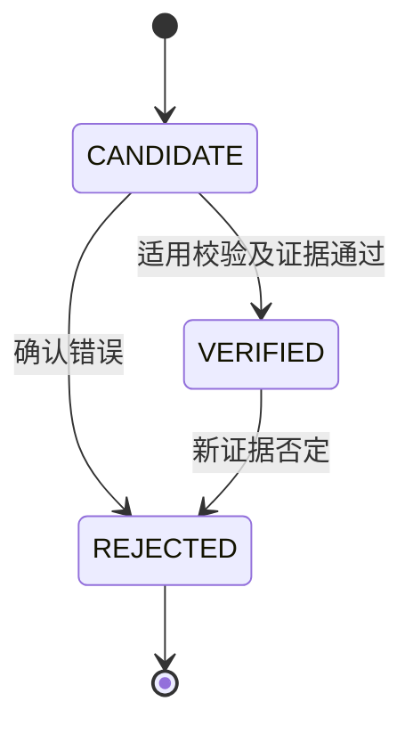
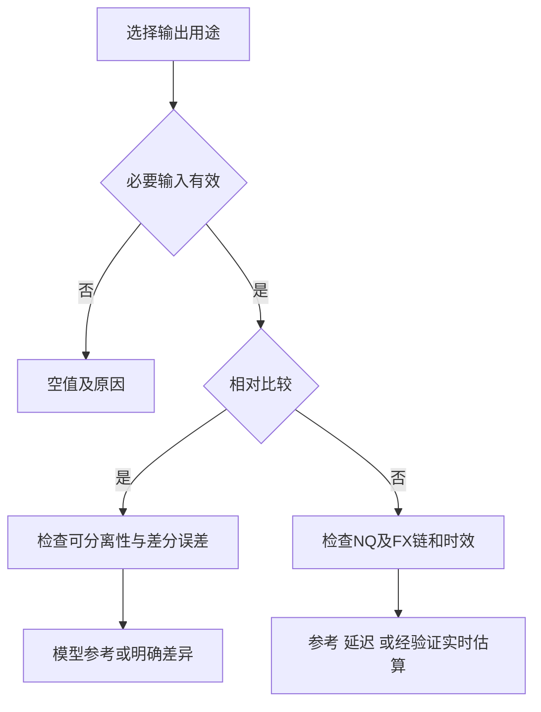

# QDII ETF质量、状态与输出契约

文档ID：QS；版本：1.0；对应SRD：1.3。QS-01—QS-08为规则组。此文件是枚举、时效阈值与理由码的唯一规范源；业务SRD引用本文件，不再维护第二套阈值。默认策略版本QPOL-1.0。

## QS-01 正交质量维度

每个相对结果、E-NAV、A-NAV、A-NAV代理和官方IOPV分别持有quality对象。删除旧单值quality兼容字段，避免它隐藏真实维度。字段值及含义如下：

| 字段 | 完整枚举 | 含义 |
|---|---|---|
| availability | AVAILABLE / UNAVAILABLE | 该指标是否有足够合法输入；null须有原因 |
| freshness | CURRENT / RECENT / AGING / STALE / UNKNOWN / NOT_APPLICABLE | 时间新旧；不表达来源可信度 |
| provenance_confidence | VERIFIED / MODEL_ASSUMPTION / PROXY / UNKNOWN | 本指标依赖的来源／语义已核验、包含有说明假设、代理或未知；不等于模型准确性 |
| delay_status | NONE_VERIFIED / DECLARED / SUSPECTED / UNKNOWN / NOT_APPLICABLE | 是否已证实无系统延迟、明确延迟、疑似延迟、未知或非动态指标 |
| model_status | UNCALIBRATED / HISTORICAL_VALIDATED / INTRADAY_VALIDATED / NOT_APPLICABLE | 日终验证不等于盘中验证 |
| anchor_health | NORMAL / AGED / EXTENDED / INVALID / NOT_APPLICABLE | 海外交易日计数与锚点有效性 |
| alignment | ALIGNED / TIME_SKEW / UNKNOWN / NOT_APPLICABLE | 各动态输入是否符合启用策略 |
| delivery_health（每来源） | ADVANCING / NOT_ADVANCING / UNKNOWN / NOT_APPLICABLE | 报文真实事件或已核验快照是否推进 |
| market_phase（每市场／ETF） | PREOPEN / OPENING_AUCTION / CONTINUOUS / BREAK / CLOSING_AUCTION / CLOSED / HALTED / UNKNOWN | 数据新鲜不等于可交易 |
| book_state | TWO_SIDED / LIMIT_UP_LOCKED / LIMIT_DOWN_LOCKED / ONE_SIDED_BOOK / BOOK_INCOMPLETE / EMPTY_BOOK / UNKNOWN | 由当前盘口、规则及阶段确定 |
| side_state | VALID / EMPTY_CONFIRMED / MISSING / INVALID / UNKNOWN | 无挂单与接入错误分开 |
| nav_status | CANDIDATE / VERIFIED / REJECTED | 首版三态；待复核是CANDIDATE的原因，替代关系用supersedes_id |
| can_buy_at_ask / can_sell_at_bid | TRUE / FALSE / UNKNOWN | 仅描述可见报价，不保证最终成交 |
| anchor_capture_status | READY / MISSING / BACKFILLING / FAILED / NOT_REQUIRED | 按NQ源分别显示 |
| relative_status | MODEL_REFERENCE / ROBUST_DIFFERENCE / UNRESOLVED / INELIGIBLE | 数值参考、在已声明边界下差异明确、差异不能确定、无准入条件 |

provenance_confidence针对指标依赖项判断：完整M0仍有满仓假设，通常为MODEL_ASSUMPTION；合约不明但可解释的序列为PROXY；unknown X₀导致默认相对比较不可用，不能被“共因子抵消”覆盖。不同不确定原因保留数组，不仅保留最差一个。模型可信度和来源可信度分别展示。

## QS-02 年龄、延迟与对齐的唯一决策表

所有秒数为可版本化初值。age_wall=max(0,computed_at−event_time)，事件未来超过DS-10容差则隔离；age_at_target=target_time−event_time。保存每个输入年龄和最大值，不将抓取频率当源更新频率。

| 每个动态输入相对当前的年龄 | freshness |
|---|---|
| 0—15秒，含15 | CURRENT |
| >15—60秒，含60 | RECENT |
| >60—120秒，含120 | AGING |
| >120秒 | STALE |
| 日期、时区、字段语义或本机时钟无法验证 | UNKNOWN |
| 静态NAV、日频已定盘汇率及历史锚点本身 | NOT_APPLICABLE；另评anchor_health或规则有效性 |

每个指标freshness取必要动态输入最差值：UNKNOWN优先，其后STALE、AGING、RECENT、CURRENT；无动态输入才NOT_APPLICABLE。availability不覆盖freshness，例如缺锚点时可同时显示UNAVAILABLE和CURRENT。

已知10分钟延迟源可以有STALE的当前年龄，同时delivery_health=ADVANCING、delay_status=DECLARED，不代表服务断流；可以输出标注τ的延迟历史结果。未知延迟源60—120秒明确为AGING，不能叫“供应商延迟已证实”。只有权威标记或可验证对照能把delay_status升级为NONE_VERIFIED／DECLARED；相关性和短RTT不能独立证明无延迟。

| 输出策略 | 输入年龄与跨度 | 展示与限制 |
|---|---|---|
| RELATIVE_REFERENCE（R） | 各ETF age_wall≤60秒，组内事件跨度≤60秒，同一价格类型及交易阶段 | “相对估值参考”，显示最大时差；有差分误差边界才标明确差异 |
| ABSOLUTE_REFERENCE（E） | ETF/NQ/即期FX age_wall≤120秒，动态跨度≤60秒；身份、锚点及连续性足以支持当前所用模型 | “盘中参考估算”；60秒只是对齐上限，不授予实时标签 |
| DELAYED_REFERENCE（E可选） | 共同τ，所有输入event_time≤τ且age_at_target≤60秒、跨度≤60秒；真实年龄单列 | “截至τ的延迟估算”；若没有对应历史ETF和FX则不开此功能 |
| VALIDATED_REALTIME（V，后续） | ETF和NQ age_wall≤15秒、即期FX≤30秒、ETF/NQ差≤15秒、全部动态跨度≤30秒；无已知延迟且语义验证通过 | 实时性标签可用；模型校准状态仍独立，不把M0说成真实NAV |

因此FX20秒、ETF/NQ5秒可满足V的时效条件，freshness整体为RECENT、界面仍逐项显示年龄。应用显示“实时估算”须同时通过V的门槛和Phase 0来源核验；不能仅凭freshness=CURRENT自动赋予该标签。若不愿采用该较宽FX上限，可在新policy_version统一收紧，不能出现隐藏15秒总跨度限制。

**as-of规则：** 首版同批次轮询后冻结不可变输入包，为可用基金组选择τ；每输入取event_time≤τ且received_at≤cutoff的最新有效记录，不四舍五入到同秒，不取未来最近点。单只失效先剔除，其余继续。跨午休／停牌／恢复阶段的旧ETF盘口不用于当前机会提示。可保留几批近期快照，无须高性能事件引擎；乱序报文保留审计但不倒退当前指针，不要求首版自动重排。标称支持延迟历史输出时，必须有足以覆盖延迟的真实缓存，不能只保留几秒。

保存input_ids、τ、cutoff、各输入实际时间、max_skew_seconds和policy_version。报价没变但有效盘口快照推进仍可新鲜；只有received_at变化不能算真实推进。高波动或跳变超过已有差分误差场景时，将relative_status改为UNRESOLVED；60秒不会因为平均1σ很小就免除尾部风险。

## QS-03 开盘、恢复及锚点健康

北京时间09:15是排除凌晨NQ缓存的附加检查，不是放行阈值。09:30若NQ应开放但报价还停在维护前或09:15之前，标SESSION_NOT_ADVANCED；09:16报价也不能通过当前年龄要求。NQ按日历休市时保留相应历史参考及FUTURES_CLOSED，不把正常休市自动判作采集故障。

启动、重连、来源切换、午休恢复、复牌及维护后须核对会话身份和年龄。实时标签／机会提醒恢复须3个有效推进样本；价格无需变化，相同缓存重复3次不算。首版相对参考可展示首个合格样本但标RECOVERY_PENDING，尚不授予ROBUST_DIFFERENCE。

anchor_age_sessions为从各NAV股票锚点a至c已完成的海外交易时段数，0—3为NORMAL，4—10为AGED，>10为EXTENDED；版本、日期或事件无效为INVALID并令相应指标不可用。AGED必须加ANCHOR_AGED并报告差分／绝对误差未充分覆盖的风险；EXTENDED仅在假日或披露日历及完整因子链支持下提供明确的实验参考，不授予ROBUST_DIFFERENCE。日龄不替代真实日历。

## QS-04 盘口与数值

只有有限正价格且有限正数量、单位及快照已核验，才构成VALID一侧。0、"0.000"、正价格配0数量均不可执行，标准price和volume为null；保留raw字段。源契约确认无挂单才EMPTY_CONFIRMED，空串／缺字段／NaN／无穷值／负数为MISSING或INVALID，不能用来证明封板。一侧失效不抹去另一侧有效报价。

连续交易且当日涨停U、跌停L有规则依据时：买一=U且有量、对侧EMPTY_CONFIRMED为LIMIT_UP_LOCKED；卖一=L且有量、对侧EMPTY_CONFIRMED为LIMIT_DOWN_LOCKED。未知限价不猜封板；有双边则TWO_SIDED，即使最新成交触及限价。删除旧AT_LIMIT盘口枚举，必要时通过PRICE_AT_LIMIT理由说明。集合竞价指示价不套连续盘口规则。

封死涨停的买入溢价null、有效卖出溢价可保留；封死跌停相反。两侧均明确空为EMPTY_BOOK，未知侧为BOOK_INCOMPLETE。以上均抑制机会提醒；首版可不显示精细LOCKED分类，但必须识别无效／单边报价并隔离相关买入比较。

所有估值分母必须有限且>0；零卖价会产生−100%假折价，不能等除零报错。成交价可能不在稍后盘口内，不据此单独丢弃；同刻持续矛盾则标SOURCE_CONFLICT。跨源对比初始阈值ETF2个最小价位、NQ0.10%、FX0.05%，先确认合约、时点和价格类型相同。期货tick异常不自动取整修复。

## QS-05 净值三态及事件



状态变化追加记录；修正后的新数据重新创建CANDIDATE，不覆盖旧值。新记录VERIFIED后以supersedes_id连接旧版本，无需SUPERSEDED状态；旧VERIFIED记录在历史知识截止时刻仍可被引用。一次切换固定NavRecord、验证记录和已包含事件，避免新NAV与旧事件链混用。

PENDING_VERIFY仅是候选记录的reason_code。分红公告日至生效日记录CORPORATE_ACTION_PENDING，但不冻结正常事件前净值。受影响日、口径未知或冲突候选留在CANDIDATE，优先与管理人正式网页／结构化披露／PDF比对；首版可由维护者在本地记录依据和处理时间，不建设审批系统或确认人账户。自动普通校验允许直接通过。

旧锚点仍可信且事件链完整时可以继续绝对参考估算；受影响事件导致VM-10乘法分离不成立时，相对输出仍应隔离。旧值已被否定或事件未知则相应结果UNAVAILABLE。确认事件后新NAV时，不再扣已含分红；重复报文不增加revision、不重置first_seen_at或重复扣息。原净值、获知与验证时间都保留，后来的确认不倒灌历史。

## QS-06 展示与提醒决策

质量字段全量保留，首屏优先显示影响当前用途的原因，不用单个枚举覆盖其他字段。



NQ缺失只影响依赖它的绝对结果；共同市场不可用不自动污染相对质量。反之基金自身NAV／事件无效会影响其两种结果。默认排序为相对M0参考分组；失效对象移至末尾。ROBUST_DIFFERENCE只表示在已说明的差分边界下有区别，不意味着可以买入获利。

首版关闭价格机会通知，仅提供状态条。后续FR16启用时，须另外验收：当前连续交易、完整双边有效盘口、无封板或待解决事件、当次对齐合格、恢复检查完成；绝对通知需V且适用于盘中的误差区间有依据，相对通知需成对差分边界合格。未校准、代理或未知时效只可展示参考，不发高可信机会通知。

连续有效满足阈值30秒，冷却300秒，回穿0.20个百分点后可重触发；相对阈值以δ明确表达，不能沿用绝对百分点名义。午休、封板、停牌、失效立即重置；发送前复查当前状态，不补发历史τ的信号。状态提醒与价格机会提醒分开；软件内通知没有后台送达保证。

## QS-07 理由码登记表

枚举值只用于对应字段；同名理由码仅在下表出现时才允许进入reason_codes。新代码须修改QS版本及对应测试，未知代码不得悄悄解释为正常。

| 原因码 | 定义／影响 |
|---|---|
| NAV_MISSING / NAV_REJECTED | 没有可用单位净值／已知净值错误；受影响指标不可用 |
| NAV_FX_RULE_UNKNOWN | 锚点或目标估值FX规则未知；限制对应指标与默认相对比较 |
| PENDING_VERIFY / CORPORATE_ACTION_PENDING | 候选需复核／未来基金事件待生效；后者不自动冻结正常NAV |
| NONSEPARABLE_EVENT / FACTOR_GROUP_MISMATCH | 跨锚点加法事件／非同类因子组，简单相对比较不适用 |
| CONTRACT_UNKNOWN / TICK_MISMATCH | 合约身份未知／与所声称价格类型的格点不符 |
| FUTURE_ANCHOR_MISSING / ROLL_ANCHOR_MISSING | 缺c锚点／缺换月衔接证据 |
| SOURCE_ANCHOR_MISMATCH | 主备源当前行情与锚点不属于已验证可比系列 |
| FX_MISSING / FX_STALE / CNH_PROXY | 即期缺失／过期／离岸代理 |
| KNOWN_DELAY / SUSPECTED_DELAY | 明确供应商延迟／仅存在疑点，二者不混用 |
| TIME_SKEW / TIME_UNVERIFIED / FUTURE_TIMESTAMP | 超策略对齐跨度／时间语义未知／未来事件异常 |
| SESSION_BOUNDARY | 为当前计算选中的ETF样本来自不允许跨越的午休、停牌或竞价阶段；不泛指跨自然日 |
| SESSION_NOT_ADVANCED / FUTURES_CLOSED / RECOVERY_PENDING | 未跨过应已恢复会话／期货正常休市／尚未满足恢复样本数 |
| CLOCK_SKEW / CLOCK_UNVERIFIED | 系统同步偏移超2秒／没有可信同步状态 |
| CALENDAR_UNCERTAIN / CALENDAR_SYNC_DEGRADED | 所需会话缺口或已知冲突／同步失败但本地仍适用 |
| ANCHOR_AGED / ANCHOR_EXTENDED / ANCHOR_INVALID | 锚点4—10个海外时段／>10个／版本或事件链无效 |
| EMPTY_CONFIRMED / QUOTE_MISSING / QUOTE_INVALID | 源确认无挂单／字段缺失／数值或单位非法 |
| ZERO_PRICE_OR_VOLUME / NONFINITE_NUMBER / NONPOSITIVE_NAV | 无效零价量／非有限数／净值分母非正 |
| PRICE_AT_LIMIT / LIMIT_UP_LOCKED / LIMIT_DOWN_LOCKED | 价格触及限价／涨停封板／跌停封板；前者不代表封板 |
| ONE_SIDED_BOOK / BOOK_INCOMPLETE | 单边盘口／无法判断缺失原因 |
| SOURCE_CONFLICT / SOURCE_ACCESS_BLOCKED | 同口径输入冲突／来源访问被拒，停止或退避 |
| MODEL_UNCALIBRATED / FULL_EXPOSURE_ASSUMPTION | 模型未校准／采用M0满仓假设 |
| DIFFERENTIAL_UNCALIBRATED / DIFFERENCE_UNRESOLVED / STRESS_OUTSIDE_BUDGET | 差分边界无依据／差异不足以辨认／行情超情景覆盖 |
| PCF_FX_PROXY / PCF_FX_REFERENCE_LAG / PCF_FX_UNUSABLE | 受限PCF代理／参考日期落后／字段不合格（后续功能） |
| ANCHOR_CAPTURE_FAILED / BACKFILL_FAILED | 捕获失败／补采失败，界面显示实际源及c |
| HISTORICAL_RESEARCH_ONLY / REPLAY_INPUT_MISSING | 无当时知识时间的研究资料／输入已缺失无法完整回放 |
| SYNTHETIC_FIXTURE | 合成输入，禁止进入生产历史及提醒 |

## QS-08 目标JSON形态

以下为合成例，真实输出必须填真实时点、NAV日期、输入和版本引用。is_fixture承载测试身份，不往market_phase枚举里塞FIXTURE。相对结果独立于绝对值存在；本例只给单只基金，因此未计算成对结果。can_buy等字段为有效连续盘口的可见条件，不代表承诺成交。

```json
{
  "code": "513100",
  "exchange": "SSE",
  "is_fixture": true,
  "target_time": "2026-09-15T02:00:00Z",
  "knowledge_cutoff": "2026-09-15T02:00:01Z",
  "computed_at": "2026-09-15T02:00:01Z",
  "factor_group": "NDX_USD_UNHEDGED",
  "price_basis": "ASK",
  "model_version": "M0-1.0",
  "policy_version": "QPOL-1.0",
  "calendar_version": "fixture-calendar-1",
  "tzdb_version": "fixture-tz-1",
  "contract_versions": [
    "fixture-source-1"
  ],
  "nav_anchor": {
    "id": "fixture-nav-1",
    "unit_nav": 2.0,
    "nav_date": "2026-09-11",
    "status": "VERIFIED"
  },
  "factors": {
    "spot": 1.02,
    "future": 1.01,
    "fx": 1.02
  },
  "prices": {
    "last": 2.2,
    "bid1": 2.197,
    "ask1": 2.203
  },
  "estimates": {
    "economic": {
      "nav": 2.101608,
      "premium_last": 0.046817484516617824,
      "premium_buy": 0.0482449629045949,
      "premium_sell": 0.045390006128640525,
      "quality": {
        "availability": "AVAILABLE",
        "freshness": "CURRENT",
        "provenance_confidence": "MODEL_ASSUMPTION",
        "delay_status": "NONE_VERIFIED",
        "model_status": "UNCALIBRATED",
        "anchor_health": "NORMAL",
        "alignment": "ALIGNED",
        "reason_codes": [
          "SYNTHETIC_FIXTURE",
          "FULL_EXPOSURE_ASSUMPTION",
          "MODEL_UNCALIBRATED"
        ]
      }
    },
    "accounting": {
      "nav": null,
      "quality": {
        "availability": "UNAVAILABLE",
        "freshness": "NOT_APPLICABLE",
        "provenance_confidence": "UNKNOWN",
        "delay_status": "NOT_APPLICABLE",
        "model_status": "UNCALIBRATED",
        "anchor_health": "NORMAL",
        "alignment": "NOT_APPLICABLE",
        "reason_codes": [
          "NAV_FX_RULE_UNKNOWN"
        ]
      }
    },
    "accounting_proxy": null
  },
  "relative_result": {
    "benchmark_code": null,
    "ratio": null,
    "relative_gap": null,
    "status": "UNRESOLVED",
    "quality": {
      "availability": "UNAVAILABLE",
      "freshness": "CURRENT",
      "provenance_confidence": "MODEL_ASSUMPTION",
      "delay_status": "NONE_VERIFIED",
      "model_status": "UNCALIBRATED",
      "anchor_health": "NORMAL",
      "alignment": "ALIGNED",
      "reason_codes": [
        "DIFFERENCE_UNRESOLVED"
      ]
    }
  },
  "ages_seconds": {
    "etf": 2,
    "nq": 3,
    "fx": 5
  },
  "max_skew_seconds": 3,
  "market_phase": "CONTINUOUS",
  "book_state": "TWO_SIDED",
  "can_buy_at_ask": "TRUE",
  "can_sell_at_bid": "TRUE",
  "opportunity_alert_allowed": false,
  "input_bundle_id": "fixture-bundle-1",
  "input_snapshot_ids": [
    "fixture-etf-1",
    "fixture-nq-1",
    "fixture-fx-1",
    "fixture-nav-1"
  ]
}
```
